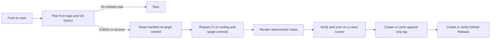

# Release the action

Use this runbook to publish Vexcalibur Action or recover a current-format tag
whose GitHub Release was not created.

The annotated Git tag is the only action version. Release versions are not
stored in source files. A release tag can never move, be deleted, or be reused.
If a release is wrong, fix it under a later tag. Mutable aliases are branches,
not tags.

The workflow creates no tag until CI passes for the exact release commit.

## Before you merge

Confirm these conditions:

- The candidate is based on the current `main` branch.
- The local checks in [Contributing](../../CONTRIBUTING.md) pass.
- `action-compatibility.json` names only the package and Python versions that CI
  exercises.
- The release and development dependency locks pass the checks in
  [Contributing](../../CONTRIBUTING.md#refresh-dependency-locks).
- The organization enforces GitHub release immutability for the repository.
- The `vexcalibur-dev` automation GitHub App is installed on this repository.
- The organization variable `AUTOMATION_CLIENT_ID` and secret
  `AUTOMATION_SECRET` are available to the repository.
- The organization variable `RELEASE_POLICY_ATTESTATION` contains current
  owner-reviewed ruleset evidence for this repository.
- The App can read repository administration settings and write repository
  contents. The active `restricted release tag creation` ruleset allows only
  that App to create `v*` tags. The active `immutable release tags` ruleset
  blocks updates and deletion with no bypass.
- `gh auth status` succeeds for the maintainer who will verify or dispatch the
  release.

In Bash, fetch tags and inspect the plan from the repository root:

```bash
git fetch --tags origin
scripts/release.py plan
```

The command prints `operation`, `tag`, `previous_tag`, `bump`, `sha`,
`notes_format`, `expected_notes_sha256`, `expected_tag_graph_sha256`, and
`make_latest`. The notes digest is empty for a new release and populated during
recovery. The graph digest binds every existing release tag name, tag object,
and target commit. The latest flag is true for a new release or recovery of the
highest tag, and false otherwise. The command does not write a tag or source
file. `operation=publish` proposes a new tag at the current commit,
`operation=recover` selects an existing tag without changing it, and
`operation=skip` creates nothing.

Confirm the repository inherits enforced immutable releases from the
organization:

```bash
IMMUTABLE_STATE="$(
  gh api repos/vexcalibur-dev/vexcalibur-action/immutable-releases \
    --jq '[.enabled, .enforced_by_owner] | @tsv'
)"
if [[ "${IMMUTABLE_STATE}" != $'true\ttrue' ]]; then
  printf 'Unexpected immutable-release state: %s\n' "${IMMUTABLE_STATE}" >&2
  exit 1
fi
printf 'Immutable releases are enforced by the organization.\n'
```

Run the command in Bash with a GitHub account that can read repository
administration settings. It prints a success message only when both settings
are true. Stop before merge if it fails.

Confirm that the App registration grants read access to repository
administration settings:

```bash
APP_ADMINISTRATION_PERMISSION="$(
  gh api apps/vexcalibur-dev-automation \
    --jq '.permissions.administration // "missing"'
)"
if [[ "${APP_ADMINISTRATION_PERMISSION}" != "read" ]]; then
  printf \
    'Unexpected App administration permission: %s\n' \
    "${APP_ADMINISTRATION_PERMISSION}" >&2
  exit 1
fi
printf 'The automation App can read repository administration settings.\n'
```

This checks the live App registration. The organization owner must also approve
the changed permission for the installed App. Stop before merge if GitHub shows
that the installation is waiting for approval.

GitHub omits ruleset bypass principals from responses unless the caller can
write the ruleset. Keep that permission away from the publishing App. Instead,
an organization owner must run this preflight with an authenticated `gh`
session before enabling or changing release automation:

```bash
set -euo pipefail

POLICY_DIR="$(mktemp -d)"
trap 'rm -rf "${POLICY_DIR}"' EXIT
IMMUTABLE_ID="$(
  gh api repos/vexcalibur-dev/vexcalibur-action/rulesets \
    --jq '.[] | select(.name == "immutable release tags") | .id'
)"
CREATION_ID="$(
  gh api repos/vexcalibur-dev/vexcalibur-action/rulesets \
    --jq '.[] | select(.name == "restricted release tag creation") | .id'
)"
APP_ID="$(gh api apps/vexcalibur-dev-automation --jq .id)"
gh api \
  "repos/vexcalibur-dev/vexcalibur-action/rulesets/${IMMUTABLE_ID}" \
  > "${POLICY_DIR}/immutable.json"
gh api \
  "repos/vexcalibur-dev/vexcalibur-action/rulesets/${CREATION_ID}" \
  > "${POLICY_DIR}/creation.json"
POLICY_ATTESTATION="$(
  scripts/release.py attest-rulesets \
    --immutable-json "${POLICY_DIR}/immutable.json" \
    --creation-json "${POLICY_DIR}/creation.json" \
    --repository vexcalibur-dev/vexcalibur-action \
    --app-id "${APP_ID}"
)"
gh variable set RELEASE_POLICY_ATTESTATION \
  --org vexcalibur-dev \
  --repos vexcalibur-action \
  --body "${POLICY_ATTESTATION}"
scripts/release.py verify-attested-rulesets \
  --immutable-json "${POLICY_DIR}/immutable.json" \
  --creation-json "${POLICY_DIR}/creation.json" \
  --attestation <(
    gh variable get RELEASE_POLICY_ATTESTATION \
      --org vexcalibur-dev
  ) \
  --repository vexcalibur-dev/vexcalibur-action \
  --app-id "${APP_ID}"
```

The final command prints `verified live release rules against the owner policy
attestation`. Run this preflight again after any change to either ruleset. A
runtime response that omits bypass principals is accepted only while its live
ruleset IDs and revision timestamps match this owner-reviewed evidence.

## Publication sequence

This diagram follows the trust and publication sequence from a push to `main`
through the immutable Git tag and GitHub Release.



The default workflow token remains read-only. The generator renders release
notes from the immutable commit range and target manifest, then records the
artifact digest. A second runner verifies and scans those exact bytes. The
publisher independently requires the scanned artifact and digest to match the
generator's digest before it mints a repository-scoped App token. Before it
creates a tag, it verifies owner-enforced immutable releases and both named tag
rulesets through the GitHub API.

The annotated tag binds five facts: tag name, target commit, compatibility
manifest digest, release-note format, and release-note digest. The tag refspec
is create-only: it has no force, update, or delete path. The mutable coordination
branch uses an exact force-with-lease. If the remote tag already exists, the
workflow fetches it into an isolated temporary ref and requires the target and
complete annotation to match. If the tag is absent, the workflow requires the
complete remote tag graph to match the digest captured during planning. It also
rejects a target commit that already has a strict release tag. A changed name,
tag object, target, or extra lower tag stops publication.

Tag creation and the mutable `release-coordination` branch advance in one
atomic Git push guarded by an exact lease. Concurrent publishers can therefore
create at most one new tag from the same observed state. The coordination
branch is internal state, not a release identity or a consumer ref; only the
annotated tag identifies a version.

The note format is a release protocol, not an action version. Format `1` renders
commit subjects as literal code, so a subject cannot activate a link or notify
a GitHub user or team. Golden tests freeze the format and its manifest parser.
A future manifest schema, path, or note layout must use a new protocol value
while the renderer keeps support for every format used by a recoverable tag.

The GitHub Release is a convenience projection of that tag. At publication or
recovery time, the workflow requires the exact scanned notes, App author, tag
name, title, public state, immutable state, and an empty asset list. GitHub's
immutable-release setting protects the associated tag and release assets, but
it still permits title and body edits. The annotated tag and its release-note
digest remain authoritative. GitHub ignores `target_commitish` when a tag
already exists, so the workflow verifies the remote tag object instead.

A new highest tag becomes the latest GitHub Release. Recovery of the highest
tag does the same, but recovery of an older tag explicitly opts out. The
workflow checks the `/releases/latest` endpoint after publication so an older
recovery cannot replace the current release in GitHub's UI or API.

Release-note artifact names pass from each producer job to its consumer. A
rerun of failed jobs therefore reuses artifacts from successful jobs in the
original attempt instead of looking for files under the new attempt number.
These artifacts expire after one day, so rerun failed jobs before then. After
they expire, start a new Release workflow run and inspect its plan. Supply an
explicit tag only when the planner reports `operation=recover`; never alter the
existing tag.

## Tag calculation

`scripts/release.py plan` examines every commit since the highest strict
`vMAJOR.MINOR.PATCH` tag:

| Commit message | Result |
| --- | --- |
| `type!:` or a `BREAKING CHANGE:` / `BREAKING-CHANGE:` entry in the final footer paragraph | Major bump |
| `feat:` | Minor bump |
| `fix:`, `perf:`, `refactor:`, `deps:`, or `revert:` | Patch bump |
| `build(deps):`, `chore(deps):`, or a Git-generated `Revert "..."` | Patch bump |
| Only `docs:`, `test:`, `ci:`, or unrecognized types | No release |
| A commit containing `[skip release]` or `[release skip]` | That commit never contributes to a later bump |
| No previous release tag | Manual dispatch must supply the first tag |

Scopes are accepted, as in `feat(action): ...`. A breaking change wins over a
feature or patch; a feature wins over a patch. Text elsewhere in a commit body
does not act as a breaking footer.

CI also runs `scripts/check-action-contract.py` against `action.yml` and
`action-compatibility.json` at the highest release tag. Release metadata sets a
minimum bump:

| Contract change | Minimum bump |
| --- | --- |
| Description-only change | None |
| Add an optional input, an input with a default, or an output | Minor |
| Remove an input or output | Major |
| Change an input default or output value | Major |
| Make an input required, or add one without a default | Major |
| Change `runs.using` | Major |
| Add an input deprecation warning | Minor |
| Change or remove an input deprecation warning | Patch |
| Change the tested Vexcalibur package | Patch |
| Add a tested Python version | Minor |
| Remove a tested Python version | Major |
| Reformat `action-compatibility.json` without changing its values | None |

The commit range must meet both classifiers. The release planner repeats the
contract comparison against the same tag graph it uses for the next version,
so a newer tag can't make an earlier CI result authorize a smaller bump. For
example, adding an optional input under a `fix:` commit fails CI because that
public addition needs a minor release.

An explicit tag must:

- Use `vMAJOR.MINOR.PATCH` without leading zeros.
- Keep each numeric component at or below `999999`.
- Exceed the highest tag when creating a release.
- Meet or exceed the bump required by unskipped commits.
- Meet or exceed the bump required by the public contract and compatibility
  declaration.
- Identify a commit that has no other release tag.

Pre-release and build suffixes are rejected. Before planning, the module also
requires every strict release tag to be annotated, reachable, unique by commit,
and ordered consistently with commit ancestry.

## Publish from main

1. Merge the prepared pull request into `main` with the intended Conventional
   Commit title.
2. Open the `CI` workflow for the merge commit and require `CI result` to pass.
3. Open the `Release` workflow for the same commit.
4. Confirm `Resolve release candidate` reports the expected tag and SHA.
5. Confirm the note generation and scanning jobs pass.
6. Wait for `Publish GitHub Release` to finish.

The workflow requires its commit to be the current `main` tip when its
serialized run begins. It then binds that exact commit and waits for its CI.
New commits may reach `main` while publication is in progress; they don't
change the bound candidate or its immutable tag. A later serialized run
evaluates those commits from the newly published tag.

## Verify the published state

Set the tag and expected merge commit shown by the completed workflow:

```bash
set -euo pipefail

RELEASE_TAG=vMAJOR.MINOR.PATCH
EXPECTED_SHA=REPLACE_WITH_FULL_RELEASE_COMMIT_SHA
EXPECTED_AUTHOR=vexcalibur-dev-automation[bot]
VERIFY_REF="refs/vexcalibur-release/manual/${RELEASE_TAG}"
WORK_DIR="$(mktemp -d)"

cleanup() {
  git update-ref -d "${VERIFY_REF}" >/dev/null 2>&1 || true
  rm -rf "${WORK_DIR}"
}
trap cleanup EXIT

git update-ref -d "${VERIFY_REF}"
git fetch --no-tags origin \
  "refs/tags/${RELEASE_TAG}:${VERIFY_REF}"
RELEASE_SHA="$(git rev-parse --verify "${VERIFY_REF}^{commit}")"
if [[ "${RELEASE_SHA}" != "${EXPECTED_SHA}" ]]; then
  echo "Release tag targets ${RELEASE_SHA}, expected ${EXPECTED_SHA}." >&2
  exit 1
fi

COMPATIBILITY_FILE="${WORK_DIR}/action-compatibility.json"
RELEASE_JSON="${WORK_DIR}/release.json"
RELEASE_NOTES="${WORK_DIR}/release-notes.md"
git cat-file blob "${RELEASE_SHA}:action-compatibility.json" \
  > "${COMPATIBILITY_FILE}"
COMPATIBILITY_SHA256="$(
  python3 -c \
    'import hashlib,sys; print(hashlib.sha256(open(sys.argv[1], "rb").read()).hexdigest())' \
    "${COMPATIBILITY_FILE}"
)"

gh api \
  "repos/vexcalibur-dev/vexcalibur-action/releases/tags/${RELEASE_TAG}" \
  > "${RELEASE_JSON}"
RELEASE_JSON="${RELEASE_JSON}" RELEASE_NOTES="${RELEASE_NOTES}" python3 - <<'PY'
import json
import os
from pathlib import Path

release = json.loads(Path(os.environ["RELEASE_JSON"]).read_text(encoding="utf-8"))
body = release.get("body")
if not isinstance(body, str):
    raise SystemExit("GitHub Release body is missing")
Path(os.environ["RELEASE_NOTES"]).write_text(body, encoding="utf-8")
PY
NOTES_SHA256="$(
  python3 -c \
    'import hashlib,sys; print(hashlib.sha256(open(sys.argv[1], "rb").read()).hexdigest())' \
    "${RELEASE_NOTES}"
)"
NOTES_FORMAT="$(
  git for-each-ref --format='%(contents)' "${VERIFY_REF}" |
    awk -F ': ' '$1 == "Release-Notes-Format" {print $2; exit}'
)"

scripts/release.py verify-tag \
  --ref "${VERIFY_REF}" \
  --tag "${RELEASE_TAG}" \
  --commit "${RELEASE_SHA}" \
  --compatibility-sha256 "${COMPATIBILITY_SHA256}" \
  --notes-format "${NOTES_FORMAT}" \
  --notes-sha256 "${NOTES_SHA256}"
scripts/release.py verify-release \
  --release-json "${RELEASE_JSON}" \
  --notes-file "${RELEASE_NOTES}" \
  --expected-author "${EXPECTED_AUTHOR}" \
  --tag "${RELEASE_TAG}" \
  --commit "${RELEASE_SHA}" \
  --notes-format "${NOTES_FORMAT}" \
  --compatibility-sha256 "${COMPATIBILITY_SHA256}"
```

Both commands print `verified` and exit with status `0` on success. This proves
that the local tag, manifest, notes, and current GitHub Release agree at the
time of the check. It also checks that GitHub reports the release as immutable
and that no assets were attached. The EXIT trap removes the private working
directory and isolated verification ref whether verification succeeds or
fails.

## Dispatch an explicit tag

Use manual dispatch when the next tag must be explicit or a current-format tag
needs recovery.

1. Open the repository's **Actions** tab and select **Release**.
2. Choose **Run workflow** with the branch set to `main`.
3. Enter a complete `vMAJOR.MINOR.PATCH` tag.
4. Run the workflow and verify the result.

An explicit new tag cannot understate the Conventional Commit bump. Manual
dispatch does not bypass CI, graph validation, scanning, or remote-state checks.

## Recover an incomplete release

Before dispatching recovery, fetch the tag and confirm that the planner accepts
its canonical metadata:

```bash
set -euo pipefail

RELEASE_TAG=vMAJOR.MINOR.PATCH
WORK_DIR="$(mktemp -d)"
trap 'rm -rf "${WORK_DIR}"' EXIT
git clone --quiet \
  https://github.com/vexcalibur-dev/vexcalibur-action.git \
  "${WORK_DIR}/repository"
cd "${WORK_DIR}/repository"
scripts/release.py plan --tag "${RELEASE_TAG}"
```

Continue only when the command prints `operation=recover`. The workflow reads
the immutable tag target after `main` advances. It regenerates the same notes
from Git, checks their digest against the tag, verifies the manifest and full
annotation, and creates only the missing GitHub Release.

Recovery requires retained successful `CI` runs for both the current `main`
commit that supplies the publisher and the tagged commit. They are the same for
a new release, but usually differ during recovery. Check the tagged commit
before dispatching:

```bash
RELEASE_SHA="$(git rev-parse --verify "refs/tags/${RELEASE_TAG}^{commit}")"
gh run list \
  --workflow ci.yml \
  --branch main \
  --commit "${RELEASE_SHA}" \
  --limit 1000 \
  --json conclusion,status,url
```

At least one listed run must have `status` set to `completed` and `conclusion`
set to `success`. If GitHub no longer retains that evidence, don't create or
alter a release for the old tag. Merge a corrective commit, let CI pass, and
publish a later tag that binds the commit with current CI evidence.

Tags created before `action-compatibility.json` and the canonical annotation
format cannot be recovered automatically. Keep their existing records as
historical state. If a legacy GitHub Release is missing or wrong, publish a
later current-format release instead. Do not add metadata by moving, deleting,
or recreating an old tag, and don't retrofit its GitHub Release.

Any target, annotation, note, or GitHub Release conflict is terminal for that
version. Preserve the evidence and investigate privately when needed. Then
merge a corrective commit, let CI pass, and publish a later tag without
changing the existing tag. The workflow never repairs a conflict by editing
published state.

## Diagnose a failed run

| Failure | Meaning | Recovery |
| --- | --- | --- |
| Stale-main refusal | A newer commit reached `main` before the serialized run began. | Let the newer `main` run calculate the release. |
| CI did not pass for the tooling or target SHA | The current publisher or exact release candidate failed or has no retained successful CI run. | Correct the current tooling and let CI pass. Don't create or alter a release for an old tag without retained CI evidence. |
| Compatibility declaration is missing or invalid | The target has no valid release metadata input. | Correct it before a new tag. Leave a legacy tag unchanged and publish a later current-format release. |
| Tag graph validation fails | A tag is lightweight, unreachable, duplicated, or out of ancestry order. | Stop. Existing tags remain unchanged. |
| Locked planner or scanner installation fails | A wheel or hash differs from `requirements-release.txt`. | Review and refresh locks through a pull request. |
| Release-note digest fails | Artifact bytes differ across runner boundaries. | Stop and inspect the workflow artifacts. |
| Release-note artifact expired | More than one day passed before the failed-job rerun. | Start a new Release workflow run and inspect its plan. Supply an explicit tag only for `operation=recover`; never change the existing tag. |
| Release-note secret scan fails | Deterministic notes contain a secret-like value from commit history. | Inspect privately and rotate a real secret first. If the commit is already public, follow the authorized sensitive-data removal process. For a reviewed false positive or unsuitable public subject, add a new deterministic note protocol that omits or redacts it; never change a tag that already exists. |
| Existing tag metadata differs | The protected tag conflicts with the attempted release. | Do not change it. Investigate and use a later version. |
| Existing GitHub Release differs | Its body, tag name, author, state, title, or assets conflict. | Stop and investigate. The workflow never edits a conflicting release. |
| Latest-release verification fails | GitHub promoted the wrong release or did not promote the new highest tag. | Stop and inspect `/releases/latest`. Do not edit or recreate a tag. Fix the workflow, then recover the same tag only when its immutable metadata still matches. |
| App token or tag creation fails | App installation, secret, variable, scope, administration-read permission, or contents-write permission is missing. | Restore the documented App configuration and rerun. |

## Inspect notes before publication

Render the exact notes locally from the candidate and its previous tag:

```bash
RELEASE_TAG=vMAJOR.MINOR.PATCH
RELEASE_SHA=REPLACE_WITH_FULL_RELEASE_COMMIT_SHA
PREVIOUS_TAG=vPREVIOUS_MAJOR.PREVIOUS_MINOR.PREVIOUS_PATCH
NOTES_FORMAT="$(
  scripts/release.py plan |
    awk -F= '$1 == "notes_format" {print $2; exit}'
)"

scripts/release.py render-notes \
  --tag "${RELEASE_TAG}" \
  --commit "${RELEASE_SHA}" \
  --previous-tag "${PREVIOUS_TAG}" \
  --notes-format "${NOTES_FORMAT}" \
  --output /tmp/vexcalibur-action-release-notes.md
detect-secrets-hook \
  --baseline .secrets.baseline \
  -- /tmp/vexcalibur-action-release-notes.md
```

No scanner output and exit status `0` mean the notes match the current secret
baseline. Review the file as well; the scanner cannot decide whether public
commit text is appropriate release prose. If sensitive data has already been
published, rotate it and follow the [private security process](../../SECURITY.md).
Remove `/tmp/vexcalibur-action-release-notes.md` after the review.
