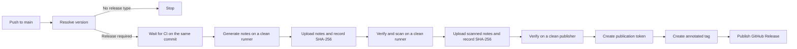

# Release the action

Use this runbook to publish a Vexcalibur Action release or recover a run that created the tag but not the GitHub Release.

A release tag is permanent. If a published action is wrong, fix forward with a new version; don't move or reuse the tag.

The workflow won't write a tag until continuous integration (CI) passes on the exact release commit.

## Before you merge

Confirm all of these conditions:

- The release candidate is based on the current `main` branch.
- The full local check suite in [Contributing](../../CONTRIBUTING.md) passes.
- `.github/workflows/ci.yml` sets `VEXCALIBUR_RELEASE_PACKAGE_VERSION` to the exact package release this action version supports.
- The prospective action tag and `vexcalibur==...` spec appear together in [the compatibility table](../reference/compatibility.md).
- The release and development dependency locks pass the checks in [Contributing](../../CONTRIBUTING.md#refresh-dependency-locks).
- The `vexcalibur-dev` automation GitHub App is installed on this repository.
- The organization variable `AUTOMATION_CLIENT_ID` and secret `AUTOMATION_SECRET` are available to the repository.
- The app can write repository contents for this repository. The release workflow uses that permission to create tags and GitHub Releases.

Fetch release tags and inspect the version calculation from the repository root:

```bash
git fetch --tags origin
scripts/next-release-tag.sh
```

The command only prints its decision; it doesn't create a tag. Check `skip`, `tag`, `version`, `previous_tag`, and `bump` before you merge. If the proposed tag isn't in the compatibility table, update the table in the same pull request.

## How the workflow publishes

The release pipeline follows this path:



In text: a push to `main` either stops after version classification or waits for CI on that exact commit. One clean runner generates release notes and uploads them with a separately recorded SHA-256 digest. A second runner verifies that digest, installs the wheel-only, hash-locked scanner closure, scans the notes, and uploads a new artifact with its digest. A third clean runner downloads the scanned artifact and verifies its digest before it creates an annotated tag and publishes the release.

The default workflow token has read-only `actions` and `contents` permissions. GitHub's generated-release-notes endpoint requires contents-write permission, so the generator creates a short-lived, repository-scoped app token after CI passes. That token and runner end before the scanner starts. The scanner receives no app token, referenced repository secret, restored dependency cache, or publication credential. Its filesystem, package cache, and `PATH` state are discarded before the publisher starts. The final publisher installs no packages, executes no scanner, and creates a new publication token only after the scanned artifact passes digest verification. Generated and scanned artifacts expire after one day.

## Version rules

`scripts/next-release-tag.sh` reads commit messages since the latest valid `vMAJOR.MINOR.PATCH` tag:

| Commit message | Result |
| --- | --- |
| No previous release tag | Initial `v0.1.0` release |
| `type!:` or a `BREAKING CHANGE:` / `BREAKING-CHANGE:` footer | Major bump |
| `feat:` | Minor bump |
| `fix:`, `perf:`, `refactor:`, `deps:`, or `revert:` | Patch bump |
| `build(deps):`, `chore(deps):`, or a Git-generated `Revert "..."` | Patch bump |
| Only `docs:`, `test:`, `ci:`, or unrecognized types | No release |
| Current commit message contains `[skip release]` or `[release skip]` | No automatic release |
| Manual workflow version | The requested version, subject to the rules below |

Scopes are accepted, as in `feat(action): ...`. A breaking marker takes precedence over feature and patch messages; a feature takes precedence over patch messages.

A manual version must:

- Use `MAJOR.MINOR.PATCH`, with an optional leading `v`.
- Contain no leading zeros.
- Keep each numeric component at or below `999999`.
- Be greater than the latest release, unless it names the latest tag already attached to the current `main` commit for recovery.

Pre-release and build suffixes aren't accepted for action tags.

## Publish automatically

The workflow starts on every push to `main`.

1. Merge the prepared pull request into `main` with the intended Conventional Commit-style title.
2. Open the `CI` workflow for the merge commit and wait for **CI result** to pass.
3. Open the `Release` workflow for the same commit.
4. Confirm that **Resolve release candidate** reports the expected tag.
5. Confirm **Generate release notes** and **Scan release notes** pass on their separate runners.
6. Wait for **Publish GitHub Release** to finish.

The release workflow stops if a newer commit reaches `main` while it is running. It also stops after about 15 minutes if CI for the release commit never completes.

## Verify the release

Set the tag and expected merge commit, then inspect the release and the dereferenced annotated tag:

```bash
RELEASE_TAG=v0.2.0
EXPECTED_SHA=REPLACE_WITH_FULL_RELEASE_COMMIT_SHA

gh release view "${RELEASE_TAG}" \
  --repo vexcalibur-dev/vexcalibur-action \
  --json tagName,targetCommitish,isDraft,isPrerelease,url

REMOTE_SHA="$(
  git ls-remote --tags \
    https://github.com/vexcalibur-dev/vexcalibur-action.git \
    "refs/tags/${RELEASE_TAG}^{}" |
    cut -f1
)"
test "${REMOTE_SHA}" = "${EXPECTED_SHA}"
```

Success means the release exists, isn't a draft or prerelease, and the final `test` exits with status `0`. Read the generated notes and confirm that they describe only the intended changes.

## Dispatch a manual version

Use manual dispatch when the next version must be explicit.

1. Open the repository's **Actions** tab and select **Release**.
2. Choose **Run workflow**.
3. Keep the branch set to `main`.
4. Enter `MAJOR.MINOR.PATCH`, such as `0.3.0`.
5. Run the workflow.
6. Verify the release with the commands above.

The requested version doesn't bypass CI, the compatibility-table check, the stale-commit guard, or the secret scan.

## Recover an incomplete release

If the annotated tag exists on the current `main` commit but the GitHub Release is missing, rerun **Release** manually with that same version. The script returns `bump=existing`; the publish job keeps the existing tag and creates the missing release.

Stop if the tag points to another commit. Don't move it. Investigate the unexpected tag and choose a later version once the repository state is understood.

## Diagnose a failed run

| Failure | Meaning | Recovery |
| --- | --- | --- |
| `Refusing to release from a stale main workflow run` or `Refusing to publish a stale release` | A newer commit reached `main`. | Start from the current `main` commit. Let its push trigger a new run, or dispatch the workflow there. |
| `CI did not pass` | CI for the exact release commit completed unsuccessfully. | Fix the failure in a new pull request. Don't release the failing commit. |
| `Timed out waiting for CI` | No successful CI result arrived during the wait window. | Inspect the CI run. After it passes, rerun Release for the current `main` commit. |
| Compatibility-table verification fails | The computed tag and expected package spec don't appear in one table row. | Add the row in a pull request, merge it, and release the new commit. |
| Locked scanner installation fails | A required wheel or hash doesn't match `requirements-release.txt`. | Don't bypass hash checking. Review and refresh the locks through the documented procedure in a pull request. |
| Generated or scanned release-note digest fails | The artifact differs from the bytes produced or approved by the preceding runner. | Stop the release. Inspect the workflow run and artifacts; rerun only after the unexpected change is understood. |
| Release-note secret scan fails | Generated notes contain a secret-like value. | Inspect the notes privately. Rotate any real secret, fix the source text, and rerun only after the notes are safe. |
| Tag exists on a different commit | The requested version has already been used. | Don't move the tag. Investigate, then choose a higher version. |
| Tag exists on the current commit but the release is missing | A prior run stopped after tag creation. | Dispatch the same version to reuse the tag and create the release. |
| App token creation or tag push fails | App installation, repository scope, variable, secret, or contents permission is missing. | Restore the documented app configuration, then rerun for the same current commit. |

## Inspect release notes locally

You need an authenticated GitHub CLI session and the development requirements from [Contributing](../../CONTRIBUTING.md). Set the values below; leave `PREVIOUS_TAG` empty only for the first release.

```bash
RELEASE_TAG=v0.2.0
RELEASE_SHA=REPLACE_WITH_FULL_RELEASE_COMMIT_SHA
PREVIOUS_TAG=v0.1.0

args=(
  repos/vexcalibur-dev/vexcalibur-action/releases/generate-notes
  -f "tag_name=${RELEASE_TAG}"
  -f "target_commitish=${RELEASE_SHA}"
)
if [[ -n "${PREVIOUS_TAG}" ]]; then
  args+=(-f "previous_tag_name=${PREVIOUS_TAG}")
fi

gh api "${args[@]}" --jq .body > /tmp/vexcalibur-action-release-notes.md
detect-secrets-hook \
  --baseline .secrets.baseline \
  -- /tmp/vexcalibur-action-release-notes.md
```

No scanner output and exit status `0` mean the notes match the current baseline. A real credential must be rotated and removed at its source, such as a pull request title or commit message. Add a baseline entry only for a reviewed false positive.

If sensitive data reached a published release, rotate it immediately and use the [private security process](../../SECURITY.md). Editing the release text doesn't make an exposed credential safe again.
