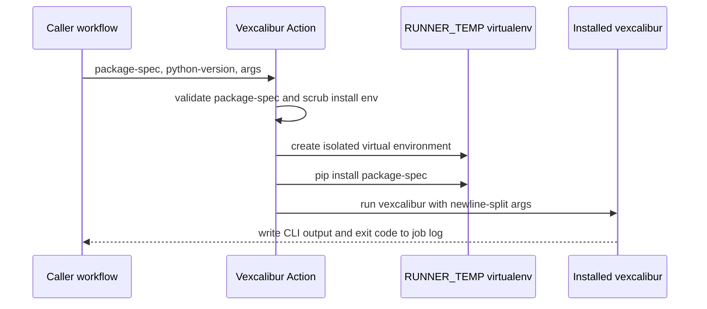

# Vexcalibur Action Reference

The Vexcalibur Action is usable for the workflows documented here. Inputs,
default values, and exit behavior can change before a 1.0 action release.

## Runner Model

The action is a thin runner for the installed `vexcalibur` executable. It does
not define a second action-specific command model. Adding a Vexcalibur CLI
command should not require changing this action.

Pass CLI arguments with `args`. Each nonblank line becomes one argument. Blank
lines are ignored. Carriage returns are removed. Leading spaces, trailing
spaces, quotes, and option-looking values are preserved as literal argument
content; the action does not perform shell parsing. Use a separate line for each
argument.

Development example:

```yaml
with:
  package-spec: git+https://github.com/vexcalibur-dev/vexcalibur.git@main
  allow-development-package-spec: "true"
  args: |
    query-osv
    --allow-public-osv
    --
    pkg:pypi/django@1.2
```

## Inputs

| Input | Required | Default | Contract |
| --- | --- | --- | --- |
| `package-spec` | Yes | None | Package spec passed to isolated `pip install`. Release workflows must use an exact release such as `vexcalibur==0.1.1`. |
| `allow-development-package-spec` | No | `false` | Set to `true` to allow Git URLs, local paths, or other non-release package specs in development workflows. |
| `constraints-file` | No | None | Absolute path to a [pip constraints file](https://pip.pypa.io/en/stable/user_guide/#constraints-files) applied to the isolated install. Pins transitive dependency versions so installs are reproducible and new PyPI releases of transitive dependencies cannot change what the action runs. |
| `python-version` | No | `3.14` | Python version passed to `actions/setup-python`. |
| `args` | No | `--help` | Newline-separated CLI arguments passed to the installed `vexcalibur` executable. Each nonblank line is one argument. |

`package-spec` is validated before installation. Without
`allow-development-package-spec: "true"`, the value must match an exact
Vexcalibur release package spec such as `vexcalibur==0.1.1`.
See the [compatibility reference](compatibility.md) for the current action tag
and package version policy.

`args` is split by line. Blank lines are ignored and carriage returns are
removed. The action does not trim spaces, remove quotes, or interpret shell
escapes. To stop option parsing for a Vexcalibur command, include `--` as its own
argument line.

`package-spec` pins the Vexcalibur version exactly, but pip resolves
Vexcalibur's transitive dependencies from PyPI at run time. Without
`constraints-file`, the resolved dependency tree can change between runs as new
releases are published. Supply-chain-sensitive workflows should check a
constraints file into the caller repository, pin every transitive dependency in
it, and pass its absolute path:

```yaml
with:
  package-spec: vexcalibur==0.1.1
  constraints-file: ${{ github.workspace }}/.github/vexcalibur-constraints.txt
```

The path must be absolute because the action runs outside the caller's
workspace. The file is passed to `pip install --constraint` inside the isolated
environment.

## Public OSV Boundary

OSV-backed Vexcalibur commands, including `query-osv` and `generate`, can send
package URLs, versions, or SBOM-derived inventory to the public OSV API through
the Vexcalibur CLI. The action does not add `--allow-public-osv` for you.
Include that CLI flag in `args` only when public OSV data sharing is explicitly
approved for the workflow.

Do not pass `--allow-public-osv` for private package inventories unless sending
that inventory to `https://api.osv.dev` is explicitly approved for the workflow.
Use a Vexcalibur CLI option such as `--osv-url`, or use offline/local findings,
when private provider support is available for the command you are running.

## Runtime Behavior

The action runs as a composite action and delegates execution to
`scripts/run-vexcalibur.sh`.



In text form: the action validates package inputs, creates an isolated virtual
environment under `RUNNER_TEMP`, installs Vexcalibur there, then runs the
installed `vexcalibur` executable with the caller-provided CLI arguments.

Runtime sequence:

1. `actions/setup-python` installs or selects `python-version`.
2. The shell step runs with `/bin/bash --noprofile --norc -e -o pipefail` and
   clears `BASH_ENV` before the script starts.
3. The script validates package installation inputs before installing
   Vexcalibur.
4. The script creates a private working directory and virtual environment under
   `RUNNER_TEMP`.
5. The script scrubs inherited `PYTHON*`, `PIP_*`, and `PIPX_*` environment
   variables before Python and pip run.
6. `pip` installs `package-spec` with `PIP_CONFIG_FILE=/dev/null`,
   `PIP_CACHE_DIR` set to the private action cache directory, `python -I`, and
   `pip --isolated --no-cache-dir`. When `constraints-file` is set, the file is
   passed as `pip install --constraint` so transitive dependency versions are
   pinned by the caller.
7. The script runs the `vexcalibur` executable from the private virtual
   environment with the arguments from `args`.

The action does not honor caller-provided executable paths such as
`VEXCALIBUR_BIN`, and it does not resolve `vexcalibur` from the caller's `PATH`.
CLI argument input is removed from the environment before installation so
install-time code does not receive `VEXCALIBUR_ARGS` or legacy
`VEXCALIBUR_PURLS`.

## Outputs

The action does not define structured GitHub Actions outputs.

Command output is written to the workflow log:

The action passes through the installed Vexcalibur CLI output.

See the Vexcalibur
[CLI reference](https://github.com/vexcalibur-dev/vexcalibur/blob/main/docs/reference/cli.md)
for the current `query-osv` output shape. Live OSV data changes over time, so
vulnerability IDs, counts, and ordering can change.

## Exit Behavior

| Condition | Exit code | Message shape |
| --- | --- | --- |
| Vexcalibur CLI succeeds | `0` | CLI output appears in the workflow log. |
| `package-spec` is missing | `2` | `package-spec is required`. |
| `package-spec` is not an exact release and development specs are not allowed | `2` | `package-spec must be an exact Vexcalibur release...`. |
| `constraints-file` is not an absolute path | `2` | `constraints-file must be an absolute path: ...`. |
| `constraints-file` does not exist or is not readable | `2` | `constraints-file does not exist or is not readable: ...`. |
| Runner Python is missing or not executable | `2` | The message names the missing or invalid runner Python value. |
| `RUNNER_TEMP` is missing | `2` | `RUNNER_TEMP is required to isolate the Vexcalibur installation`. |
| Runner temp setup fails after validation | nonzero internal setup exit | Python or shell writes the setup failure to the workflow log. |
| Installed package does not provide a `vexcalibur` executable | `127` | `vexcalibur executable was not found after installation`. |
| `pip install` fails | pip exit code | pip writes the installation error to the workflow log. |
| The Vexcalibur CLI exits nonzero | CLI exit code | The CLI writes its own failure message to the workflow log. |

## Development Verification

From the action repository root, run:

```bash
python -m pip install -r requirements-dev.txt
bash -n scripts/*.sh
git ls-files -z | xargs -0 detect-secrets-hook --baseline .secrets.baseline --
shellcheck scripts/*.sh
ASDF_ACTIONLINT_VERSION=1.7.12 actionlint .github/workflows/*.yml
python -m unittest discover -s tests
```

Expected success signal: ShellCheck and actionlint exit with status `0`, and
`unittest` reports all tests passing. `requirements-dev.txt` installs
ShellCheck and the release-note secret scanner; install actionlint through your
local toolchain before running the full local gate.

## Workflow Verification

Use the development quick-start workflows in the repository
[README](../../README.md). Expected success signals:

- `help`: the workflow passes and the action logs include Vexcalibur help
  output.
- `query-osv`: the workflow passes and the action logs include Vexcalibur CLI
  output for each submitted package URL.

The hosted CI compatibility checks also build a Vexcalibur wheel, run `help` and
`query-osv` E2E scenarios against that wheel, and upload a generated
SBOM-to-VEX artifact. See the [compatibility reference](compatibility.md) for
the current matrix.
