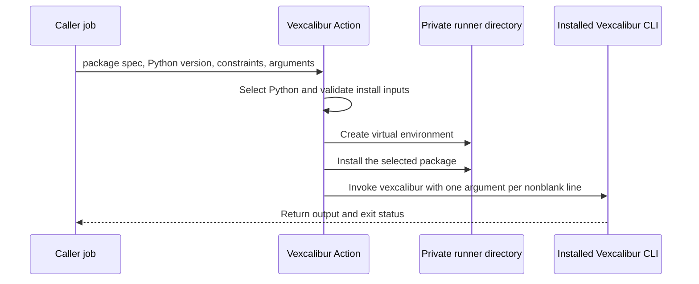

# Action reference

Vexcalibur Action is a composite GitHub Action that installs a selected Vexcalibur Python package and invokes its `vexcalibur` executable. It doesn't add a second command model: commands, flags, input formats, and Vulnerability Exploitability eXchange (VEX) output belong to the [Vexcalibur command-line interface (CLI)](https://github.com/vexcalibur-dev/vexcalibur/blob/main/docs/reference/cli.md).

The action is pre-1.0. Inputs and defaults may change between release lines.

## Runner requirements

This repository verifies the action on GitHub-hosted `ubuntu-latest` runners. The wrapper assumes `/bin/bash`, POSIX paths such as `/dev/null` and `venv/bin`, and a writable, executable `RUNNER_TEMP` directory.

Other runner operating systems aren't part of the current compatibility contract. A self-hosted runner must provide the same shell, path, and filesystem behavior.

## Inputs

The action defines these inputs:

| Input | Required | Default | Value |
| --- | --- | --- | --- |
| `package-spec` | Yes | None | The single package requirement passed to `pip install`. Release workflows use an exact spec such as `vexcalibur==0.1.1`. |
| `allow-development-package-spec` | No | `false` | The exact string `true` permits Git URLs, local wheels, paths, and other non-release package specs. Any other value leaves release-only validation in place. |
| `constraints-file` | No | Empty | Absolute path to a readable [pip constraints file](https://pip.pypa.io/en/stable/user_guide/#constraints-files). |
| `python-version` | No | `3.14` | Version request passed to `actions/setup-python`. This repository verifies Python 3.10 and 3.14. |
| `args` | No | `--help` | Newline-separated arguments for the installed `vexcalibur` executable. |

### `package-spec`

Without the development opt-in, `package-spec` must start with `vexcalibur==` and name one exact release:

```yaml
with:
  package-spec: vexcalibur==0.1.1
```

The [compatibility reference](compatibility.md) lists package versions tested with each action release.

Set `allow-development-package-spec: "true"` only for a package source you trust. This example installs the current development branch:

```yaml
with:
  package-spec: git+https://github.com/vexcalibur-dev/vexcalibur.git@main
  allow-development-package-spec: "true"
  args: --help
```

Development specs may be mutable. A package installation can run build code with the job's access to the runner, filesystem, network, and inherited environment.

### `constraints-file`

An exact `package-spec` pins Vexcalibur itself. It doesn't pin packages that Vexcalibur depends on. Pass a complete constraints file when those versions must remain stable:

```yaml
with:
  package-spec: vexcalibur==0.1.1
  constraints-file: ${{ github.workspace }}/.github/vexcalibur-constraints.txt
  args: --help
```

The path must be absolute and name a readable regular file. The action passes it to `pip install --constraint`; it doesn't create or update the file.

### `args`

Each nonblank line becomes one argument. For example:

```yaml
with:
  package-spec: vexcalibur==0.1.1
  args: |
    generate
    ${{ github.workspace }}/security/sbom.json
    --offline
    --findings-file
    ${{ github.workspace }}/security/findings.json
    --output
    ${{ runner.temp }}/vexcalibur/vex.json
```

Argument conversion follows these rules:

- Blank lines are discarded.
- A trailing carriage return is removed from each line.
- Leading and trailing spaces remain part of the argument.
- Quotes, backslashes, and shell operators remain literal text. No shell parses them.
- `--` must appear on its own line when a Vexcalibur command uses it to end option parsing.
- An explicit empty `args` value invokes `vexcalibur` with no arguments. Omitting the input uses `--help`.

Don't wrap a value in shell quotes. Put the complete value on one line, even when it contains spaces.

## File paths and working directory

The CLI runs from a newly created private directory under `RUNNER_TEMP`, not from `github.workspace`. Relative paths therefore point inside that temporary directory.

Use GitHub's absolute path contexts:

- Repository inputs: `${{ github.workspace }}/path/to/file`
- Temporary outputs: `${{ runner.temp }}/path/to/file`

Create an output's parent directory in an earlier workflow step. The action doesn't create caller-selected output directories or upload generated files.

`constraints-file` must also be absolute. Relative constraint paths fail before package installation.

## Network boundaries

Package installation may contact PyPI, a Git server, or another location named by the package spec or constraints file. The action doesn't provide an offline package cache.

Vexcalibur commands decide whether they contact GitHub or a service that implements the Open Source Vulnerabilities (OSV) API. The CLI refuses to send package URLs, versions, or inventory derived from a software bill of materials (SBOM) to the public OSV API unless `--allow-public-osv` appears in `args`. The action never adds that flag.

Use `--osv-url` for an approved private OSV-compatible endpoint, or `--offline --findings-file` for local findings. Don't pass `--allow-public-osv` for private inventory unless the disclosure is approved.

The wrapper adds no timeout or retry policy. Pip and the selected Vexcalibur command own their network behavior; set a job-level `timeout-minutes` when the workflow needs a hard limit.

## GitHub permissions and tokens

The wrapper itself doesn't call the GitHub API and declares no required `GITHUB_TOKEN` permissions. A help-only job can use `permissions: {}`.

Grant permissions for the surrounding workflow and selected CLI command. Checking out a private repository needs `contents: read`. A token-backed `vexcalibur generate --github-repo` request also needs repository contents read permission; the [Vexcalibur CLI reference](https://github.com/vexcalibur-dev/vexcalibur/blob/main/docs/reference/cli.md#vexcalibur-generate) defines its token lookup and GitHub API options.

The installed package and CLI inherit environment variables that the action doesn't scrub, including caller-provided GitHub tokens. Grant the narrowest permissions the command needs.

## Runtime model

The sequence below shows installation and command execution.



In text: the action selects Python, validates the installation inputs, creates a temporary virtual environment, installs one package spec, and runs the executable from that environment. Standard output, standard error, and the exit status flow back to the caller job.

The implementation applies these controls:

1. The run step starts `/bin/bash` without profile or startup files and clears `BASH_ENV` before the shell starts.
2. The script validates `package-spec` and `constraints-file`, then converts `args` into an array.
3. It removes action argument variables and inherited environment variables whose names begin with `PYTHON`, `PIP_`, or `PIPX_`.
4. It creates a private work directory and virtual environment under `RUNNER_TEMP` using Python isolated mode.
5. It runs pip with `--isolated --no-cache-dir`, sets `PIP_CONFIG_FILE=/dev/null`, and uses a private cache path.
6. It resolves `vexcalibur` only from the new virtual environment and passes the argument array directly to it.

The action ignores caller-provided executable paths such as `VEXCALIBUR_BIN` and doesn't search the caller's `PATH` for Vexcalibur.

The virtual environment isolates Python packages; it isn't a process sandbox. Package build code and the installed CLI retain the job's operating-system permissions, network access, accessible files, and environment variables that the action doesn't scrub. Pin and review the action, package, constraints, and CLI arguments accordingly.

## Outputs

The action defines no structured GitHub Actions outputs.

The installed CLI writes standard output and standard error to the step log. A command such as `generate --output ABSOLUTE_PATH` can write a file, but a later step must validate or upload it. Live OSV results can change, so vulnerability identifiers, counts, and order aren't stable unless the underlying data is controlled.

## Exit behavior

The action returns the first failure it encounters:

| Condition | Exit code | Diagnostic |
| --- | --- | --- |
| Vexcalibur succeeds | `0` | CLI output appears in the step log. |
| `package-spec` is empty | `2` | `package-spec is required` |
| A non-release package spec lacks the development opt-in | `2` | The message requires an exact Vexcalibur release and names the opt-in. |
| `constraints-file` is relative | `2` | `constraints-file must be an absolute path: ...` |
| `constraints-file` is missing or unreadable | `2` | `constraints-file does not exist or is not readable: ...` |
| `RUNNER_TEMP` is empty | `2` | The message says `RUNNER_TEMP` is required for isolation. |
| The selected Python path is empty or not executable | `2` | The message names `VEXCALIBUR_PYTHON`. |
| Temporary setup or virtual-environment creation fails | Nonzero setup status | Python or Bash writes the failure to the step log. |
| Package installation fails | pip's exit code | pip writes the installation error to the step log. |
| The installed package has no `vexcalibur` executable | `127` | `vexcalibur executable was not found after installation` |
| Vexcalibur fails | The CLI's exit code | The CLI writes its diagnostic to the step log. |

## Related guides

- [Generate VEX from an SBOM](../how-to/generate-vex-from-sbom.md) provides a complete artifact workflow.
- [Compatibility reference](compatibility.md) lists tested release pairs and CI coverage.
- [Vexcalibur CLI reference](https://github.com/vexcalibur-dev/vexcalibur/blob/main/docs/reference/cli.md) defines commands and provider-specific failures.
- [Contributing](../../CONTRIBUTING.md) gives the local verification commands for changes to this wrapper.
